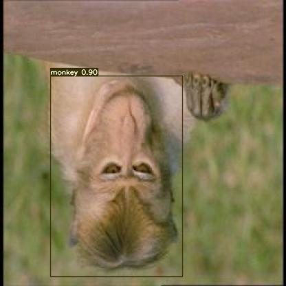
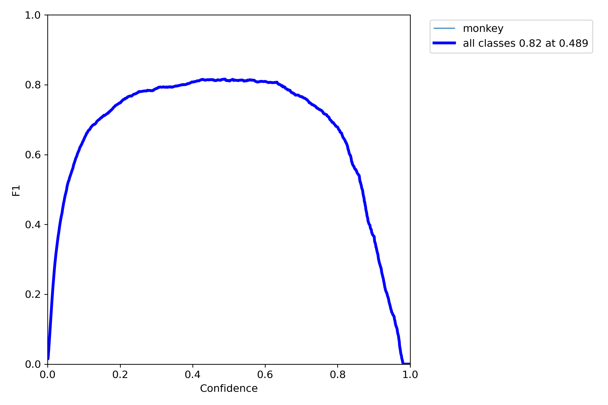
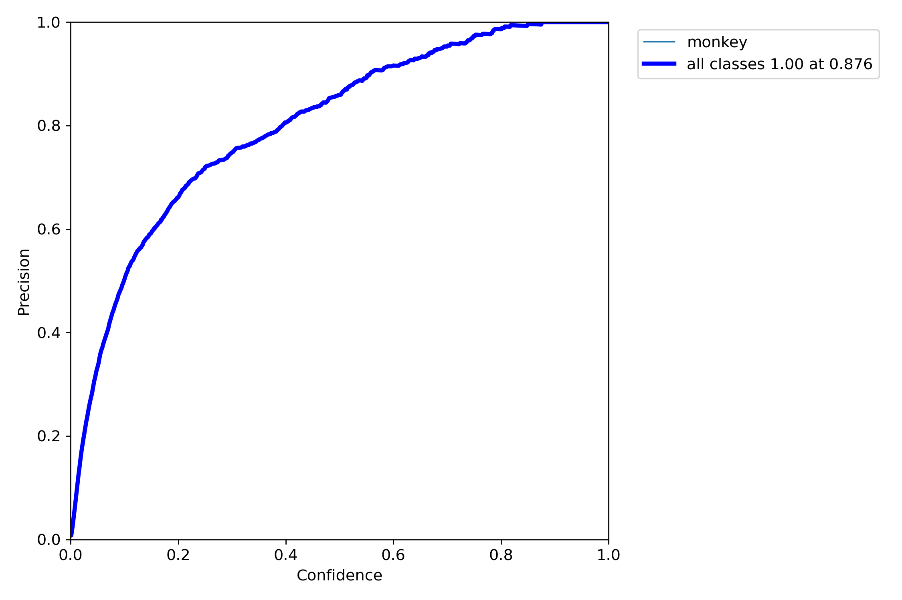
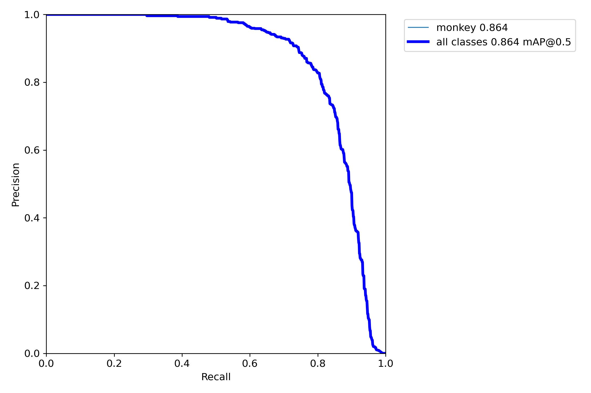
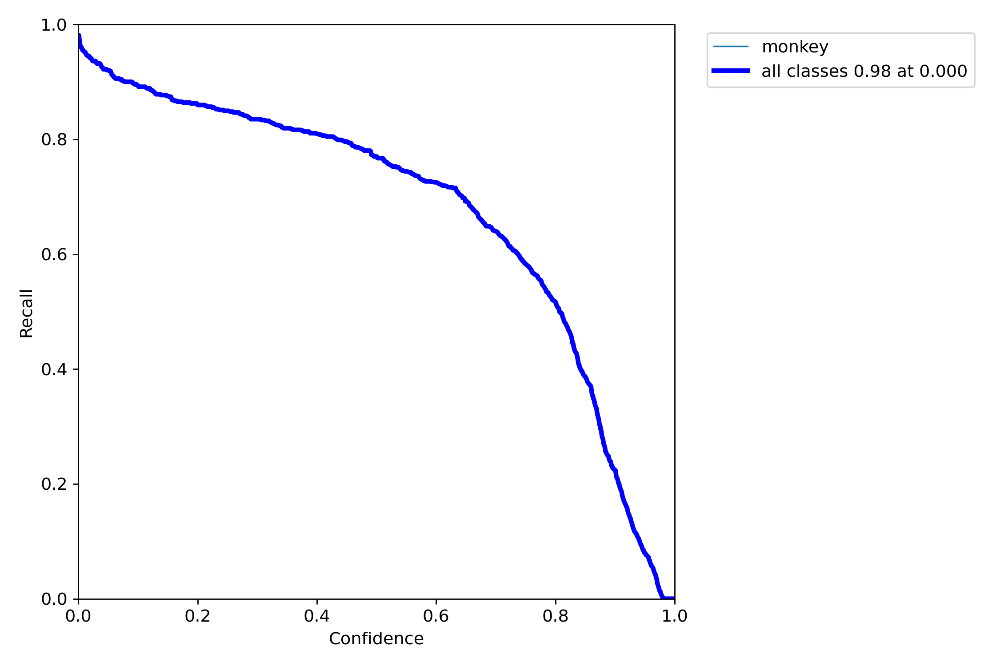
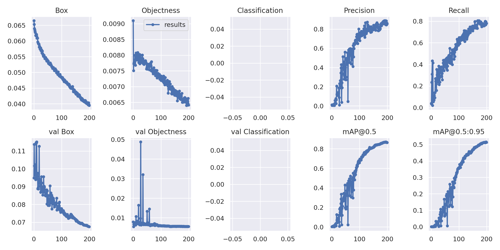
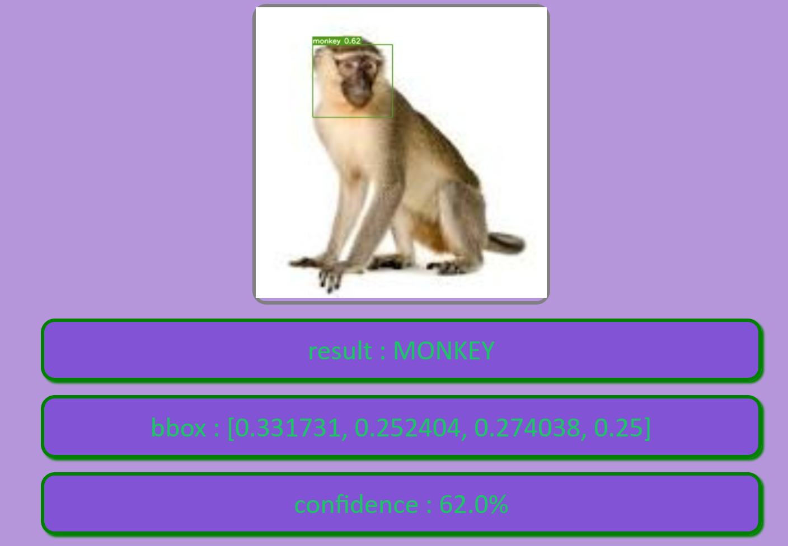
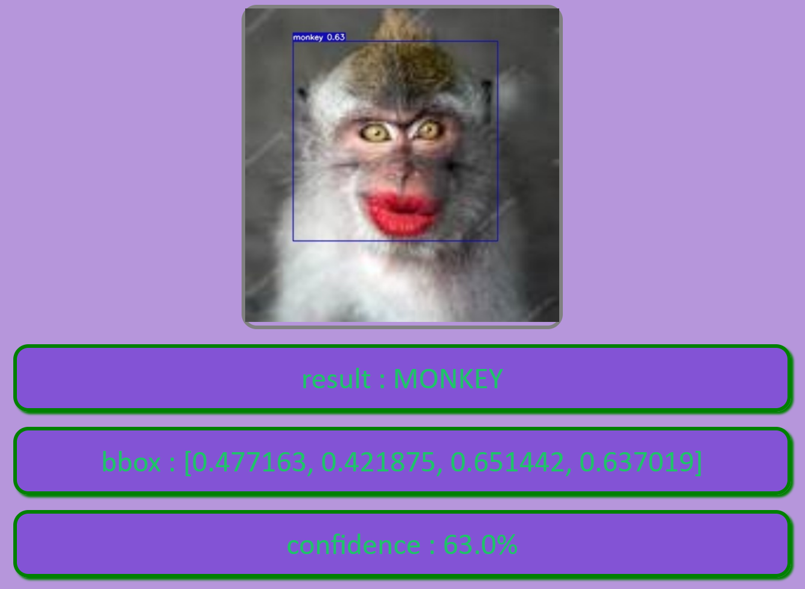
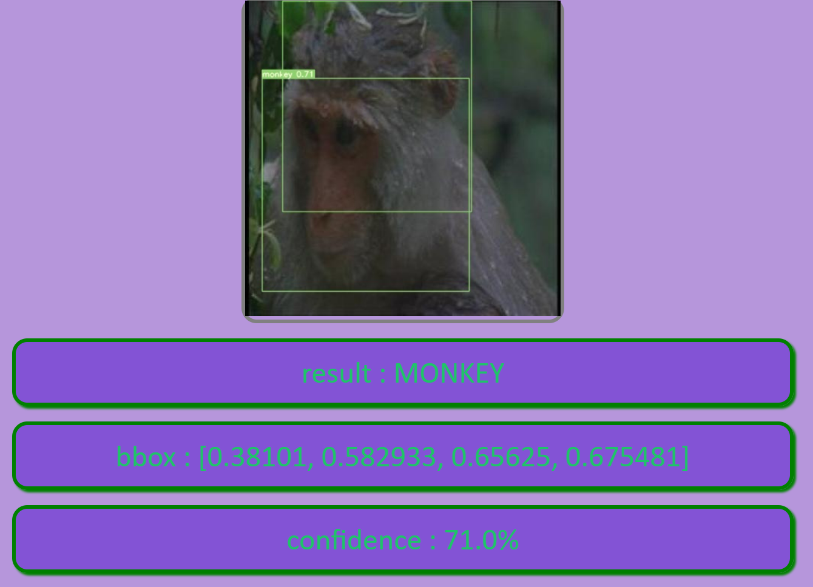

<h1 align="center">Monkey Detection using Computer Vision</h1>

<div align= "center">

<br/>

  <h4>This is an Assignment in the process of Machine Learning Internship Recruitment by IIT Bombay.</h4>

</div>

<br/>

**NOTE: Due to errors in Credit/Debit cards or errors in AWS/Google cloud platforms i was not able to deploy the application. So, I just created API & Dockerized the Application. Further Implementation of project is below. Please go through it.**

<br/>

# Table of Contents

- [Table of Contents](#table-of-contents)
- [About](#about)
- [YOLOV7](#yolov7)
  - [Performance](#performance)
  - [Installation](#installation)
  - [Testing](#testing)
  - [Training](#training)
  - [Transfer learning](#transfer-learning)
  - [Inference](#inference)
- [:file_folder: Datasets](#file_folder-datasets)
  - [🔄 Source](#-source)
- [:book: Data Preprocessing](#book-data-preprocessing)
- [Requirements](#requirements)
  - [System](#system)
  - [Python 3](#python-3)
  - [Packages](#packages)
- [Installation](#installation-1)
  - [:key: Prerequisites](#key-prerequisites)
  - [Install Python](#install-python)
  - [Creating Virtual Environment](#creating-virtual-environment)
  - [Installing dependencies](#installing-dependencies)
- [🚀&nbsp; Setup (On Production Machine)](#-setup-on-production-machine)
- [:bulb: How to Run](#bulb-how-to-run)
- [Additional guides](#additional-guides)
- [Documentation](#documentation)
  - [Input Parameters](#input-parameters)
  - [Error Handling](#error-handling)
- [📂 Directory Tree](#-directory-tree)
- [:key: Results](#key-results)
  - [Test Cases](#test-cases)
- [:clap: And it's done!](#clap-and-its-done)
  - [:raising_hand: Citation](#raising_hand-citation)
- [:heart: Owner](#heart-owner)
- [:eyes: License](#eyes-license)

<hr/>

# About

Monkey Detection using Computer Vision using AI. It uses live video stream from camera feed or rtsp streaming from ip camera or cctv or input images and use object detection to detect Monkey in these feeds. This project is part of Recruitment as an Internship in IIT Bombay. In this project I used YOLOV7 model to detect Monkey in the video feed.

<hr/>

# YOLOV7

<div align= "center"> </div>

## Performance

MS COCO

| Model                                                                                       | Test Size | AP<sup>test</sup> | AP<sub>50</sub><sup>test</sup> | AP<sub>75</sub><sup>test</sup> | batch 1 fps | batch 32 average time |
| :------------------------------------------------------------------------------------------ | :-------: | :---------------: | :----------------------------: | :----------------------------: | :---------: | :-------------------: |
| [**YOLOv7**](https://github.com/WongKinYiu/yolov7/releases/download/v0.1/yolov7.pt)         |    640    |     **51.4%**     |           **69.7%**            |           **55.9%**            |  161 _fps_  |       2.8 _ms_        |
| [**YOLOv7-X**](https://github.com/WongKinYiu/yolov7/releases/download/v0.1/yolov7x.pt)      |    640    |     **53.1%**     |           **71.2%**            |           **57.8%**            |  114 _fps_  |       4.3 _ms_        |
|                                                                                             |           |                   |                                |                                |             |                       |
| [**YOLOv7-W6**](https://github.com/WongKinYiu/yolov7/releases/download/v0.1/yolov7-w6.pt)   |   1280    |     **54.9%**     |           **72.6%**            |           **60.1%**            |  84 _fps_   |       7.6 _ms_        |
| [**YOLOv7-E6**](https://github.com/WongKinYiu/yolov7/releases/download/v0.1/yolov7-e6.pt)   |   1280    |     **56.0%**     |           **73.5%**            |           **61.2%**            |  56 _fps_   |       12.3 _ms_       |
| [**YOLOv7-D6**](https://github.com/WongKinYiu/yolov7/releases/download/v0.1/yolov7-d6.pt)   |   1280    |     **56.6%**     |           **74.0%**            |           **61.8%**            |  44 _fps_   |       15.0 _ms_       |
| [**YOLOv7-E6E**](https://github.com/WongKinYiu/yolov7/releases/download/v0.1/yolov7-e6e.pt) |   1280    |     **56.8%**     |           **74.4%**            |           **62.1%**            |  36 _fps_   |       18.7 _ms_       |

<hr/>

## Installation

Docker environment (recommended)

<details><summary> <b>Expand</b> </summary>

```shell
# create the docker container, you can change the share memory size if you have more.
nvidia-docker run --name yolov7 -it -v your_coco_path/:/coco/ -v your_code_path/:/yolov7 --shm-size=64g nvcr.io/nvidia/pytorch:21.08-py3

# apt install required packages
apt update
apt install -y zip htop screen libgl1-mesa-glx

# pip install required packages
pip install seaborn thop

# go to code folder
cd /yolov7
```

</details>

<hr/>

## Testing

[`yolov7.pt`](https://github.com/WongKinYiu/yolov7/releases/download/v0.1/yolov7.pt) [`yolov7x.pt`](https://github.com/WongKinYiu/yolov7/releases/download/v0.1/yolov7x.pt) [`yolov7-w6.pt`](https://github.com/WongKinYiu/yolov7/releases/download/v0.1/yolov7-w6.pt) [`yolov7-e6.pt`](https://github.com/WongKinYiu/yolov7/releases/download/v0.1/yolov7-e6.pt) [`yolov7-d6.pt`](https://github.com/WongKinYiu/yolov7/releases/download/v0.1/yolov7-d6.pt) [`yolov7-e6e.pt`](https://github.com/WongKinYiu/yolov7/releases/download/v0.1/yolov7-e6e.pt)

```shell
python test.py --data data/coco.yaml --img 640 --batch 32 --conf 0.001 --iou 0.65 --device 0 --weights yolov7.pt --name yolov7_640_val
```

You will get the results:

```
 Average Precision  (AP) @[ IoU=0.50:0.95 | area=   all | maxDets=100 ] = 0.51206
 Average Precision  (AP) @[ IoU=0.50      | area=   all | maxDets=100 ] = 0.69730
 Average Precision  (AP) @[ IoU=0.75      | area=   all | maxDets=100 ] = 0.55521
 Average Precision  (AP) @[ IoU=0.50:0.95 | area= small | maxDets=100 ] = 0.35247
 Average Precision  (AP) @[ IoU=0.50:0.95 | area=medium | maxDets=100 ] = 0.55937
 Average Precision  (AP) @[ IoU=0.50:0.95 | area= large | maxDets=100 ] = 0.66693
 Average Recall     (AR) @[ IoU=0.50:0.95 | area=   all | maxDets=  1 ] = 0.38453
 Average Recall     (AR) @[ IoU=0.50:0.95 | area=   all | maxDets= 10 ] = 0.63765
 Average Recall     (AR) @[ IoU=0.50:0.95 | area=   all | maxDets=100 ] = 0.68772
 Average Recall     (AR) @[ IoU=0.50:0.95 | area= small | maxDets=100 ] = 0.53766
 Average Recall     (AR) @[ IoU=0.50:0.95 | area=medium | maxDets=100 ] = 0.73549
 Average Recall     (AR) @[ IoU=0.50:0.95 | area= large | maxDets=100 ] = 0.83868
```

To measure accuracy, download [COCO-annotations for Pycocotools](http://images.cocodataset.org/annotations/annotations_trainval2017.zip) to the `./coco/annotations/instances_val2017.json`

<br/>

## Training

Data preparation

```shell
bash scripts/get_coco.sh
```

- Download MS COCO dataset images ([train](http://images.cocodataset.org/zips/train2017.zip), [val](http://images.cocodataset.org/zips/val2017.zip), [test](http://images.cocodataset.org/zips/test2017.zip)) and [labels](https://github.com/WongKinYiu/yolov7/releases/download/v0.1/coco2017labels-segments.zip). If you have previously used a different version of YOLO, we strongly recommend that you delete `train2017.cache` and `val2017.cache` files, and redownload [labels](https://github.com/WongKinYiu/yolov7/releases/download/v0.1/coco2017labels-segments.zip)

<br/>

Single GPU training

```shell
# train p5 models
python train.py --workers 8 --device 0 --batch-size 32 --data data/coco.yaml --img 640 640 --cfg cfg/training/yolov7.yaml --weights '' --name yolov7 --hyp data/hyp.scratch.p5.yaml

# train p6 models
python train_aux.py --workers 8 --device 0 --batch-size 16 --data data/coco.yaml --img 1280 1280 --cfg cfg/training/yolov7-w6.yaml --weights '' --name yolov7-w6 --hyp data/hyp.scratch.p6.yaml
```

<br/>

Multiple GPU training

```shell
# train p5 models
python -m torch.distributed.launch --nproc_per_node 4 --master_port 9527 train.py --workers 8 --device 0,1,2,3 --sync-bn --batch-size 128 --data data/coco.yaml --img 640 640 --cfg cfg/training/yolov7.yaml --weights '' --name yolov7 --hyp data/hyp.scratch.p5.yaml

# train p6 models
python -m torch.distributed.launch --nproc_per_node 8 --master_port 9527 train_aux.py --workers 8 --device 0,1,2,3,4,5,6,7 --sync-bn --batch-size 128 --data data/coco.yaml --img 1280 1280 --cfg cfg/training/yolov7-w6.yaml --weights '' --name yolov7-w6 --hyp data/hyp.scratch.p6.yaml
```

<hr/>

## Transfer learning

[`yolov7_training.pt`](https://github.com/WongKinYiu/yolov7/releases/download/v0.1/yolov7_training.pt) [`yolov7x_training.pt`](https://github.com/WongKinYiu/yolov7/releases/download/v0.1/yolov7x_training.pt) [`yolov7-w6_training.pt`](https://github.com/WongKinYiu/yolov7/releases/download/v0.1/yolov7-w6_training.pt) [`yolov7-e6_training.pt`](https://github.com/WongKinYiu/yolov7/releases/download/v0.1/yolov7-e6_training.pt) [`yolov7-d6_training.pt`](https://github.com/WongKinYiu/yolov7/releases/download/v0.1/yolov7-d6_training.pt) [`yolov7-e6e_training.pt`](https://github.com/WongKinYiu/yolov7/releases/download/v0.1/yolov7-e6e_training.pt)

<br/>

Single GPU finetuning for custom dataset

```shell
# finetune p5 models
python train.py --workers 8 --device 0 --batch-size 32 --data data/custom.yaml --img 640 640 --cfg cfg/training/yolov7-custom.yaml --weights 'yolov7_training.pt' --name yolov7-custom --hyp data/hyp.scratch.custom.yaml

# finetune p6 models
python train_aux.py --workers 8 --device 0 --batch-size 16 --data data/custom.yaml --img 1280 1280 --cfg cfg/training/yolov7-w6-custom.yaml --weights 'yolov7-w6_training.pt' --name yolov7-w6-custom --hyp data/hyp.scratch.custom.yaml
```

<hr/>

## Inference

On video:

```shell
python detect.py --weights yolov7.pt --conf 0.25 --img-size 640 --source yourvideo.mp4
```

On image:

```shell
python detect.py --weights yolov7.pt --conf 0.25 --img-size 640 --source inference/images/horses.jpg
```

<hr/>

# :file_folder: Datasets

## 🔄 Source

This dataset is downloaded from roboflow using YOLOV7 model. You can find the data [Here](https://universe.roboflow.com/monkey-detection/mm-zfbbm/dataset/2).

# :book: Data Preprocessing

Data pre-processing is an important step for the creation of a machine learning
model. Initially, data may not be clean or in the required format for the model which
can cause misleading outcomes. In pre-processing of data, we transform data into our
required format. It is used to deal with noises, duplicates, and missing values of the
dataset. Data pre-processing has the activities like importing datasets, splitting
datasets, attribute scaling, etc. Preprocessing of data is required for improving the
accuracy of the model.

# Requirements

## System

System requirements depends on complexity or size of object detection model, larger model will require more compute power and will be good at detection. I have used this in **Google Colab with Tesla T4 GPU & Kaggle with Tesla p100 GPU** which is a good device. With my Nvidia Geforce 330 MX GPU based system it is not sufficient to train a YOLOV7 model.

**Minimum of 4GB NVIDIA Graphics Card is required to train YOLOV7 model.**

## Python 3

Python 3.6 or higher. Tested with Python 3.6, 3.7, 3.8, 3.9, 3.10 in Windows 11 and Linux.

## Packages

- `Torch` >= 1.7.0
- `numpy` >= 1.18.5
- `opencv-python` >= 4.1.1

This implementation is tested with PyTorch gpu in Windows 11 and Linux and Google Colab

<hr/>

# Installation

## :key: Prerequisites

All the dependencies and required libraries are included in the file <code>requirements.txt</code> [See here](requirements.txt)

## Install Python

There are two ways to install python in windows using [Python 3 installer](https://www.python.org/downloads/) or [Anaconda](https://docs.conda.io/projects/conda/en/latest/user-guide/install/index.html). Installing python with anaconda or [miniconda](https://docs.conda.io/en/latest/miniconda.html) is recommended. In linux Python 3 is installed by default but we can also install miniconda or conda into linux.

## Creating Virtual Environment

Create a new python virtual environment using conda or venv and activate it. If Anaconda or Miniconda is installed use `conda` else use `venv` to create virtual environments.

- Using conda

```bash
conda create --name security_cam
conda activate security_cam
conda install pip
```

- Using venv in linux

```bash
python3 -m venv path/to/create/env/security_cam
source path/to/create/env/security_cam/bin/activate
```

- Using venv in windows

```bash
python -m venv path\to\create\env\security_cam
path\to\create\env\security_cam\Scripts\activate
```

## Installing dependencies

The command below will install all the required dependencies from `requirements.txt` file.

```bash
pip install -r requirements.txt
```

<hr/>

# 🚀&nbsp; Setup (On Production Machine)

Download the YOLOV7 model from [here](https://github.com/WongKinYiu/yolov7) and place it in the root directory of the project. Then copy the dataset you downloaded from Roboflow to the YOLOV7-MAIN Folder and add the data.yaml file in main directory of the project. The **data.yaml** file should contain the following information: (The dataset folder name is monkey_data)

**Note:** Clone the YOLOV7 repository and do not download as a zip since .git folder is required for training and create a "static" and "results" named empty folder after copying templates folder to YOLOV7.

```bash
git clone https://github.com/WongKinYiu/yolov7.git
```

The data.yaml file should contain the following information:

```yaml
train: monkey_data/train/images
val: monkey_data/valid/images
nc: 1
names: ["monkey"]
```

1. Change your directory to the cloned repo

```bash
cd "yolov7-main"
```

2. Also copy the files from this repository to the YOLO Folder same as the structured folder in the given drive link.

<div align="center">

[](https://drive.google.com/file/d/1fL9VM5kW1jm0_m8rXufzoNuznVLG4fQD/view?usp=sharing)

</div>

3. I used "Flask" as an API to connect the model with the web application.

4. Check out the flask file here [app.py](app.py)

5. Then I created a Docker image using [Dockerfile](Dockerfile) and pushed it to the Docker Hub.

6. We can also use [Docker-compose](docker-compose.yml) to run the application.

7. Due to errors in Credit/Debit cards or errors in AWS/Google cloud platforms i was not able to deploy the application.
<hr/>

# :bulb: How to Run

1. Open terminal. Go into the cloned project directory and type the following command:

```bash
python3 train.py --epochs 128 --workers 8 --device 0 --batch-size 32 --data data.yaml --img 416 416 --cfg cfg/training/yolov7.yaml --weights '' --name Monkey-Model --hyp data/hyp.scratch.p5.yaml
```

2. After training is done, run the following command to test the model on a video/image:

```bash
py detect.py --weights best.pt --project results --name results --source static/img.jpg --save-txt --save-conf
```

1. If you want to try the Project then run the flask file app.py

```bash
python app.py
```

<hr/>

# Additional guides

If get stuck in installation part follow these additional resources

- [Python Installation](https://www.youtube.com/watch?v=YYXdXT2l-Gg&list)
- [pip and usage](https://www.youtube.com/watch?v=U2ZN104hIcc)
- [Anaconda installation and using conda](https://www.youtube.com/watch?v=YJC6ldI3hWk)

<hr/>

# Documentation

## Input Parameters

The Input Parameters used in this project are

1. **--epochs:** Number of epochs to train the model.
2. **--workers:** Number of workers to use for data loading.
3. **--device:** Device to use for training.(0 for GPU and 1 for CPU)
4. **--batch-size:** Batch size for training.
5. **--data:** Path to data.yaml file.
6. **img:** Image size.
7. **--cfg:** Path to model.yaml file.
8. **--weights:** Path to weights file. (Leave blank for training from scratch)
9. **--name:** Name of the model.
10. **--hyp:** Path to hyperparameters file.

<br/>

## Error Handling

Mostly you are supposed to get errors regarding cv2.imwrite() to a particular folder, At that time you need to create respected folders in the main directory.

<br/>

# 📂 Directory Tree

```
├───cfg
│   ├───baseline
│   ├───deploy
│   └───training
├───data
├───deploy
│   └───triton-inference-server
│       └───data
├───models
│   └───__pycache__
├───monkey_data
│   ├───test
│   │   ├───images
│   │   └───labels
│   ├───train
│   │   ├───images
│   │   └───labels
│   └───valid
│       ├───images
│       └───labels
├───results
├───runs
│   └───train
│       └───Monkey-Model
│           └───weights
├───scripts
├───static
├───templates
├───tools
└───utils
    ├───aws
    ├───google_app_engine
    ├───wandb_logging
    └───__pycache__
```

---

# :key: Results

**Our YOLOV7 Model gives the best accuracy and some good F1 Scores etc., & you can see below :**

**F1 Score:**



**P Curve:**



**PR Curve:**



**R Curve:**



**Results:**



<br/>

## Test Cases

**Test Case 1:**



**Test Case 2:**



**Test Case 3:**



<br/>

# :clap: And it's done!

Feel free to mail me for any doubts/query :email: chagantivenkataramireddy1@gmail.com

## :raising_hand: Citation

You are allowed to cite any part of the code or our dataset. You can use it in your Research Work or Project. Remember to provide credit to the Maintainer Chaganti Reddy by mentioning a link to this repository and his GitHub Profile.

Follow this format:

- Author's name - Chaganti Reddy
- Date of publication or update in parentheses.
- Title or description of document.
- URL.

You can find the references I used in the [references.md](References.md) file.

<hr/>

# :heart: Owner

Made with :heart:&nbsp; by [Chaganti Reddy](https://github.com/Chaganti-Reddy/)

# :eyes: License

MIT © [Chaganti Reddy](https://github.com/Chaganti-Reddy/Monkey-Detection/blob/main/LICENSE)
